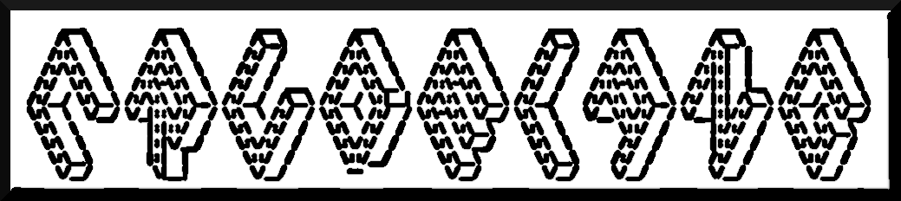
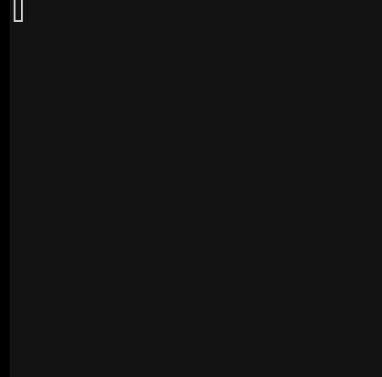

# TODO

* Cannot reference array els besides from in an assignment, or in a call expression (`id(arr[0]);`). You cannot write:

```
let arr = [1, 2];
arr[0] + 12;
if(arr[0] == 1) { ... }
```

Should fix: change logic in `isPartOfBinaryExpression`

* Decide if include anonymous fns and immediatly invoked fn.

# Setup
```
npm install
npm run build
```

# REPL
```
./repl

> 3 + 3;
6
> 2 + 2 == 5;
false
> "Hello, " + "World!";
Hello, World!
> let name = "Tux";
undefined
> name;
Tux
> map(inc, [1, 2, 3]);
[ 2, 3, 4 ]
> foldl(add, 0, [1, 2, 3, 4, 5]);
15
> filter(isOdd, [1, 2, 3, 4, 5]);
[ 1, 3, 5 ]
> define appendBang(str) { return str + "!"; }
undefined
> appendBang("Hi");
Hi!
```

# Examples
```
./crude examples/fibonacci.crude
./crude examples/factorial.crude
./crude examples/bubble-sort.crude
./crude examples/selection-sort.crude
```

## Game of Life implementation
```
./crude examples/game-of-life.crude
```

